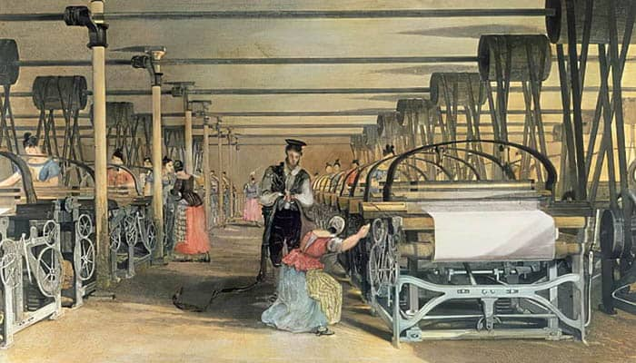
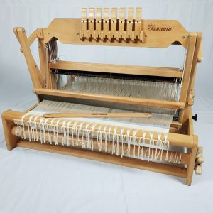
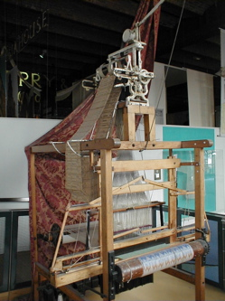

# Telares Siglo XIX
La industria textil del siglo XIX vio un gran avance gracias a la Revolución Industrial, que introdujo maquinaria como la spinning mule (1779) para hilos finos. Tejidos como el algodón estampado y la muselina se volvieron populares. Avances químicos permitieron blanquear hilos con cloro, impulsando las prendas blancas. La rápida producción de nuevos tejidos aceleró la moda, reduciendo la atención a los acabados. Las tiendas de tejidos proliferaron en las ciudades, destacando las galerías y arcadas. Este documento describe los avances tecnológicos que configuraron los tejidos, y los colores y tejidos de cada periodo histórico del siglo XIX.

## Contenido
- [Telares Siglo XIX](#telares-siglo-xix)
  - [Contenido](#contenido)
  - [Evolución Tecnológica](#evolución-tecnológica)
  - [Cambios sociales](#cambios-sociales)

## Evolución Tecnológica
1. **Telar manual**: utilizado desde tiempos prehistóricos.

2. **Telar Mecánico**: Creado por Edmund Cartwright en 1784, automatizó procesos y se popularizó en el siglo XIX.

3. **Telar Jacquard**: Introducido por Joseph Marie Jacquard en 1804, revolucionó el diseño textil al permitir patrones complejos.

## Cambios sociales
Como principales cambios sociales ocasionados por la revolución textil tenemos:
-  Desplazamiento de artesanos textiles tradicionales.
-  Migración de comunidades rurales a ciudades industriales.
-  Creación de empleos en fábricas, aunque con condiciones laborales precarias.
